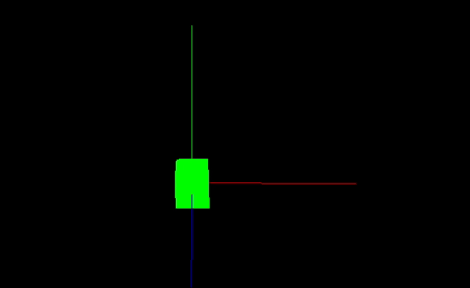
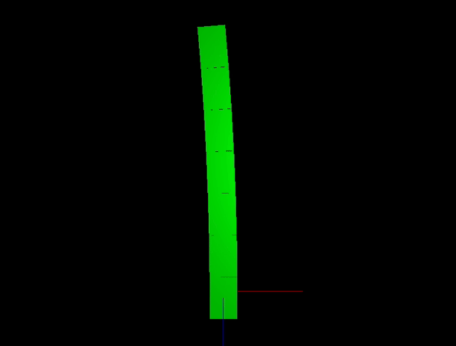
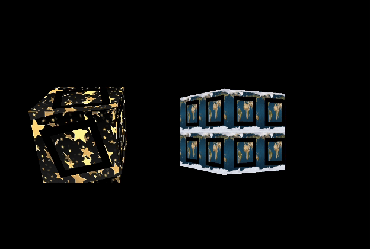

# CS 174A Assignments

These are the assignments I've completed for the class CS 174A: Introduction to Computer Graphics, in Winter 2025 taught by Professor Asish Law. 

## Assignment 1: Hello world with Three.js
An initial assignment in which we set up the environment, and make a simple rotating cube on a 3d axis.

## Assignment 2: Geometric transformations with matrices
Here, I learned geometric transformations such as translation, rotation, and shear, and applied them to a stack of cubes that tilts back and forth in a sinusoidal motion. You can press keys to start and stop the cube rotation, and to switch between wireframe and mesh cubes.

## Assignment 3: Advanced Shader and Planetary Animation
This assignment used custom shaders, as well as translation and rotation concepts from Assignment 2, to build a model of a solar system with several planets rotating around a sun. You can press keys to view the solar system from the viewpoint of different planets, and swing back out to a birds eye view.

## Assignment 4: Texture Mapping
In this assignment, I made two cubes rotating on their own axes, and mapped textures that rotate on the cube itself. By pressing 'c' on the keyboard, you can start and stop all the rotations.

